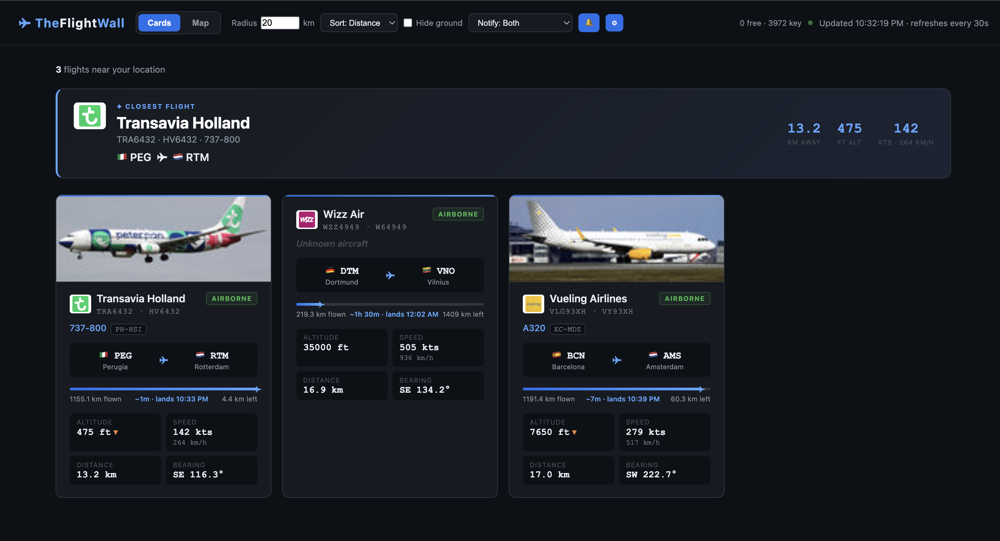
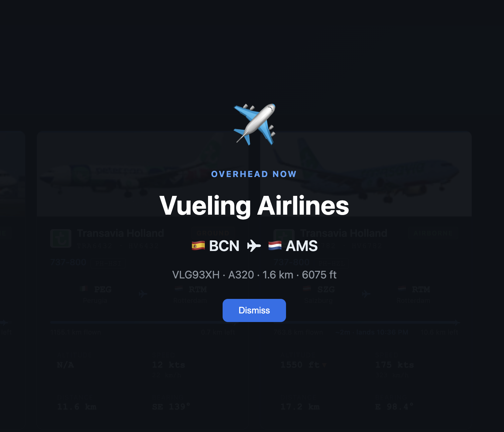
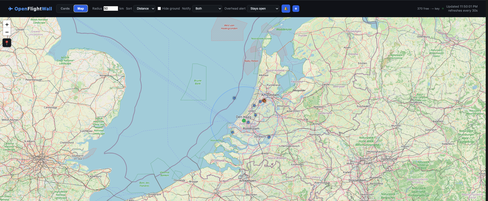

# OpenFlightWall

A zero-cost local web dashboard that shows nearby flights in real time. Runs on your machine via a Python/Flask server — no paid subscriptions required.

**Card View:**


**Browser notification:**


**Overhead notification:**


**Map view:**


**Keyless by default:** every data source works with no API key or account. The only optional setup is a **free** OpenSky account, which raises the flight-position rate limit (see [Configuration](#configuration)). Nothing here ever costs money, and if you do add credentials, they **never leave your machine** — everything runs locally, with no telemetry and no third-party server in between.

## Features

- **Card & Map views** — a responsive flight-card grid, or a live Leaflet/OpenStreetMap map with rotated plane icons.
- **Origin → destination routes** — full airport names + country flags, plus great-circle route arcs on the map.
- **Flight progress + ETA** — progress bar with km flown / remaining and a rough "lands in ~1h 23m" estimate (computed locally).
- **Aircraft photos & details** — photo, registration, manufacturer and owner from adsbdb.com.
- **Airline logos** — carrier logo on cards, hero banner and map popups (Kiwi.com public CDN).
- **Closest-flight hero banner** — spotlights the nearest aircraft (the LED-wall vibe).
- **"Overhead now" alert** — full-screen alert when a plane is within ~3 km overhead, with an optional **auto-dismiss** ("Stays open" by default; choose Dismiss in 30s / 1 / 2 / 5 min from the header, with a live "Dismiss in M:SS" countdown next to the button).
- **Sound ping** — chime when a new flight enters your radius (**on by default**; toggle in the header).
- **Browser notifications** — desktop notifications for **new flights**, **overhead only**, or **both** (**defaults to Both**; prompts for permission on first load, change or disable in the header).
- **Sort & filter** — sort by distance / altitude / airline, and a hide-on-ground toggle (labelled header controls).
- **Climb/descent + squawk** — ▲/▼ vertical-rate indicator and transponder squawk code.
- **Browser geolocation** — centres on you automatically, with a manual lat/lon entry and click-to-set fallback (no config file).
- **Adjustable radius** — change the search radius live from the header.
- **OpenSky account, in-app** — add optional free OpenSky credentials from a ⚙ Settings panel for a higher rate limit (validated live; no restart).
- **Free bucket first** — when a key is set, the app uses the free anonymous quota first and only switches to your account key once the free quota is exhausted (maximising your total daily requests).
- **Credits indicator** — the header shows remaining OpenSky credits for **both** buckets separately (free anonymous ~400/day and your account key ~4000+/day), marking which is currently in use. Updated on each refresh.

> ### Limitations
> | | |
> |---|---|
> | **OpenSky rate limit** | Works keyless, but the anonymous limit is very low (you'll hit `429` quickly). A **free** OpenSky account raises it a lot — see [Configuration](#configuration). A 30 s server cache also helps. |
> | **Community data sources** | hexdb.io (aircraft type) and adsbdb.com (routes) are community-run with no SLA — some flights may show "Unknown aircraft" or "Route unavailable". |
> | **On-ground aircraft included** | All transponders within radius are returned, including parked aircraft (use the *Hide ground* toggle). |

---

## Prerequisites

- Python **3.11+**
- A way to install dependencies — [uv](https://docs.astral.sh/uv/getting-started/installation/) is used for development, but `pyproject.toml` is a plain, standard PEP 621 file with no tool lock-in. Use uv, pip, Poetry, Pipenv, Conda, or whatever you prefer.

**Dependencies:** Flask 3.x, Requests 2.x, and python-dotenv 1.x.

---

## Quickstart

### Run with uv

```bash
uv sync
uv run python app.py
```

`uv sync` creates the local `.venv` and installs the exact dependency versions
recorded in `uv.lock`.

### Alternative — pip

```bash
python -m venv .venv
source .venv/bin/activate   # Windows: .venv\Scripts\activate
pip install flask requests python-dotenv
python app.py
```

### Other tools (Poetry, Pipenv, Conda, etc.)

There's nothing uv- or pip-specific about this project — `pyproject.toml` is a plain PEP 621 file, so any tool that reads one will work, e.g.:

```bash
poetry install
poetry run python app.py
```

Prefer a different workflow, or want to add first-class docs/lockfile support for another tool? PRs are very welcome.

**Open your browser**
```
http://localhost:5000
```

The browser will ask for permission to use your location. **Allow it** and the dashboard shows flights around you. If you deny (or geolocation is unavailable), a prompt lets you **enter your latitude/longitude manually** — or open the **Map** view and click anywhere to drop your location.

The dashboard auto-refreshes every 30 seconds.

---

## Configuration

Location and radius are set in the browser (no config file needed):

| Setting | Where | Notes |
|---|---|---|
| Location | Browser geolocation, manual lat/lon entry, or map click | Detected automatically on first load |
| Search radius | Radius input in the header (default **10 km**) | Change it live; flights re-fetch immediately |

### Optional: OpenSky account (recommended — avoids rate limits)

The app works **anonymously with no setup**, but OpenSky's anonymous API has a
*very* low rate limit — you'll hit `429 Too Many Requests` quickly. A **free**
OpenSky account raises the limit substantially.

First, get credentials:

1. Register at [opensky-network.org](https://opensky-network.org/) and sign in.
2. Open your [account page](https://opensky-network.org/my-opensky/account) → **API client** → create a new client.
3. Copy the `client_id` and `client_secret`.

Then add them **either** way:

**Option 1 — In the UI (easiest, no restart)**
- Click the **⚙ Settings** button in the header, paste the Client ID and Secret, and hit **Save & validate**.
- The app tests the credentials with OpenSky, stores them locally, and switches to the higher limit immediately. Use **Clear** to revert to keyless.

**Option 2 — `.env` file or environment variables**
```bash
cp .env.example .env
```
```dotenv
OPENSKY_CLIENT_ID=your-client-id
OPENSKY_CLIENT_SECRET=your-client-secret
```
Restart the server; it prints `OpenSky access: authenticated (OAuth)` on startup.

> **Where secrets live:** UI-saved creds go in `opensky_creds.json`; the file
> option uses `.env`. Both are **git-ignored** and stored in plain text on
> your machine only. UI-saved creds take precedence over env vars.

---

## Data Sources

All sources are **free**. Only OpenSky optionally uses a (free) account for a higher rate limit; everything else is keyless.

| Source | What it provides | URL |
|---|---|---|
| OpenSky Network | Real-time ADS-B positions, callsign, altitude, speed, heading | `opensky-network.org/api/states/all` |
| hexdb.io | Aircraft type code (e.g. `B738`) from ICAO24 hex | `hexdb.io/api/v1/aircraft/{icao24}` |
| adsbdb.com | Flight route + IATA flight number + airline telephony; and aircraft registration/owner/manufacturer/**photo** | `api.adsbdb.com/v0/callsign/{callsign}`, `.../v0/aircraft/{icao24}` |
| Kiwi.com images | Airline logos by 2-letter IATA code | `images.kiwi.com/airlines/64/{IATA}.png` |

---

## What Each Flight Card Shows

| Field | Source | Notes |
|---|---|---|
| Airline name | ICAO callsign prefix | Shown as-is (e.g. `UAL`) |
| Airline logo | Kiwi.com CDN | Shown by IATA code; hidden if none exists |
| Callsign + flight number | OpenSky + adsbdb.com | e.g. `ACA850 · AC850` (IATA flight number shown when known) |
| Aircraft type | hexdb.io | ICAO type code (e.g. `B738`) |
| Origin → Destination | adsbdb.com | Airport codes + city + country flag; "Route unavailable" if unknown |
| Flight progress + ETA | Computed | Progress bar, km flown/remaining, rough "lands in ~" estimate (great-circle, constant speed) |
| Aircraft photo & registration | adsbdb.com | Photo banner + registration/owner/manufacturer where available |
| Altitude | OpenSky | Barometric altitude in feet, with ▲/▼ climb/descent indicator |
| Speed | OpenSky | Ground speed in knots **and** km/h |
| Distance | Computed | Haversine distance from your centre point |
| Bearing / Squawk | Computed / OpenSky | Direction from you (e.g. `NE 42°`); squawk shown when reported |
| Airborne / Ground | OpenSky | `on_ground` flag from ADS-B transponder |

---

## Project Structure

```
OpenFlightWall/
├── app.py              # Flask server + full data pipeline
├── pyproject.toml      # Project metadata and dependencies
├── uv.lock             # Reproducible dependency lockfile
└── templates/
    └── index.html      # Single-file frontend (vanilla HTML/CSS/JS + Leaflet)
```

---

## How It Works

```
[Browser] ──polls every 30s──▶ GET /api/flights?lat&lon&radius
                                     │
                              Flask (app.py)
                                     │
          ┌──────────────┬──────────┼──────────────┐
          ▼              ▼          ▼              ▼
    OpenSky anon     hexdb.io   adsbdb.com     (Haversine
  (state vectors) (aircraft)   (route O/D)   distance/bearing)
          │              │          │              │
          └──────────────┴──────────┴──────────────┘
                                     │
                           Enriched JSON array
                                     │
                     [Browser renders cards / map]
```

Routes and aircraft types are cached server-side for 1 hour (they rarely change); the full flight list is cached for 30 s to respect OpenSky's rate limit.

---

## Troubleshooting

**No flights showing?**
- Increase the **Radius** in the header (try `50`–`100` km)
- Confirm your detected location is correct (open the Map view)
- OpenSky may return empty results in low-traffic airspace

**OpenSky returns `429 Too Many Requests`**
- The 30 s server-side cache prevents this under normal use
- Avoid changing the **radius** rapidly (the input is debounced, but each distinct radius is a separate request)
- For a much higher limit, add free OpenSky credentials — see *Configuration → Optional: OpenSky account* above
- The app serves the last results and auto-retries on the next 30 s poll

**Aircraft showing as "Unknown aircraft" or "Route unavailable"**
- hexdb.io / adsbdb.com don't have every registration or callsign — this is expected and harmless
- Private/military/GA aircraft often have no public route records

**Location not detected / map shows the wrong place**
- A prompt will appear to enter your latitude/longitude manually
- Or open the **Map** view and click anywhere to drop your location
- macOS: enable **System Settings → Privacy & Security → Location Services** for your browser
- If you clicked *Block*, re-allow location via the 🔒/ⓘ icon in the address bar
- Use `http://localhost:5000` (not a LAN IP) — geolocation needs a secure context

**Server error on startup**
- Ensure the uv environment is installed and current: `uv sync`

---

## Contributing

Contributions are welcome — bug fixes, new free/keyless data sources, UI improvements, docs for your favorite package manager, all of it. Open an issue or a PR. The one hard rule: this project stays zero-cost, so no paid APIs or required API keys (see [AGENTS.md](AGENTS.md) for the full constraints and an architecture overview if you're using an AI coding assistant).

---

## License

Apache License 2.0 — see [LICENSE](LICENSE).

## Credits

Built by [Dilshan Wijesooriya](https://dilshanwijesooriya.me/) ([GitHub](https://github.com/dilshanonline)) — inspired by [TheFlightWall](https://github.com/AxisNimble/TheFlightWall_OSS).
